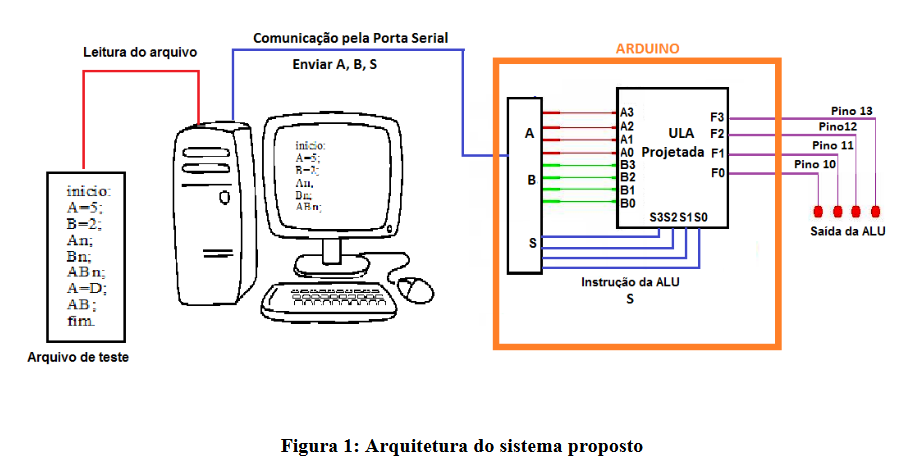

# Arduino-U.L.A.
Um "mini-compilador" e uma U.L.A. em um arduino.

Esse projeto foi desenvolvido na disciplina de Arquitetura de Computadores II. Nele, cria-se um "mini-compilador" que processa um arquivo de texto com um programa e gera instruções que são passadas para o Arduino. O Arduino, por sua vez, recebe as instruções e as executa como se fosse uma U.L.A de 4 bits.

Grupo que desenvolveu esse projeto é composto por mim, [Pedro Simões](https://github.com/PedroOliveiraSimoes) e [Thiago Gonçalves](https://github.com/ThiagoOliveiraGoncalves).

O "compilador" apresentado é o compiler.cc. O feito em Rust foi feito por mim por diversão e aprendizado.

Programa envia.exe foi disponibilizado pelo professor da disciplina e, inicialmente, só funciona no Windows.

